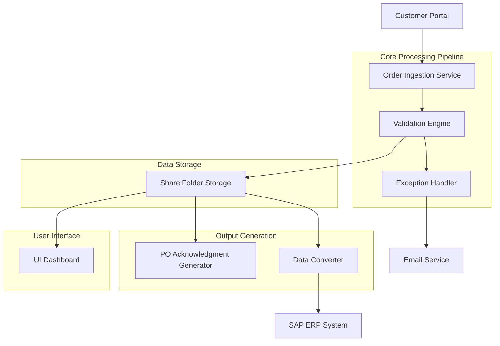

# Design Document

## Overview

The Customer Purchase Order to Sales Order system is designed as a multi-stage processing pipeline that automates order ingestion, validation, exception handling, and ERP integration. The system follows a modular architecture with clear separation of concerns between data ingestion, validation, UI presentation, and ERP integration components.

## Architecture

### High-Level Architecture



### Component Architecture

The system is organized into the following key components:

1. **Order Ingestion Service** - Downloads orders from customer portal
2. **Validation Engine** - Validates orders against supporting data
3. **Exception Handler** - Manages account-specific business rules and notifications
4. **UI Dashboard** - Displays validation results and system status
5. **Data Converter** - Generates SAP-compatible datasets
6. **Storage Layer** - Manages share folder and data persistence

## Components and Interfaces

### Order Ingestion Service

**Purpose**: Automatically downloads customer orders from the portal and initiates processing

**Key Interfaces**:
- `CustomerPortalConnector`: Interface for connecting to customer portal
- `OrderDownloader`: Downloads and queues orders for processing
- `OrderValidator`: Triggers validation workflow

**Data Flow**:
- Connects to customer portal on scheduled intervals
- Downloads exactly 4 customer orders per processing cycle
- Queues orders for validation processing
- Logs download activities and status

### Validation Engine

**Purpose**: Validates purchase orders against supporting data and business rules

**Key Interfaces**:
- `SupportingDataRepository`: Access to reference data for validation
- `ValidationRuleEngine`: Applies business rules and validation logic
- `ValidationResultHandler`: Processes validation outcomes

**Validation Process**:
- Customer information validation
- Product catalog verification
- Pricing and availability checks
- Business rule compliance verification
- Account-specific validation rules

### Exception Handler

**Purpose**: Manages account-specific processing and exception scenarios

**Key Interfaces**:
- `AccountRuleRepository`: Account-specific business rules and configurations
- `DropReasonProcessor`: Handles order rejection scenarios
- `NotificationService`: Email and alert management
- `ExceptionLogger`: Audit trail for exception handling

**Exception Processing**:
- Account-specific drop reason handling
- Automated email notifications to stakeholders
- Custom workflow execution based on account type
- Exception logging and audit trail maintenance

### UI Dashboard

**Purpose**: Provides user interface for monitoring validation results and system status

**Key Interfaces**:
- `ValidationResultDisplay`: Shows order validation outcomes
- `SystemStatusMonitor`: Real-time system health and processing status
- `OrderTrackingInterface`: Track individual order progress
- `ReportGenerator`: Generate processing reports and analytics

**Dashboard Features**:
- Real-time validation result display
- Order processing status tracking
- Exception and error reporting
- System performance metrics
- Historical processing data

### Data Converter

**Purpose**: Transforms validated purchase orders into SAP-compatible datasets

**Key Interfaces**:
- `SAPDataMapper`: Maps PO fields to SAP sales order structure
- `DataFormatConverter`: Handles data type and format conversions
- `ERPConnector`: Interface for ERP system integration

**Conversion Process**:
- Field mapping from PO to SAP sales order format
- Data type conversion and formatting
- SAP-specific business logic application
- Dataset validation before ERP submission

## Data Models

### Purchase Order Model

```typescript
interface PurchaseOrder {
  orderId: string;
  customerId: string;
  customerInfo: CustomerInfo;
  orderDate: Date;
  lineItems: LineItem[];
  totalAmount: number;
  deliveryInfo: DeliveryInfo;
  specialInstructions?: string;
  accountSpecificData: AccountData;
}

interface LineItem {
  productId: string;
  productName: string;
  quantity: number;
  unitPrice: number;
  totalPrice: number;
  deliveryDate: Date;
}
```

### Validation Result Model

```typescript
interface ValidationResult {
  orderId: string;
  validationStatus: 'PASSED' | 'FAILED' | 'WARNING';
  validationErrors: ValidationError[];
  validationWarnings: ValidationWarning[];
  validatedDate: Date;
  validatedBy: string;
  accountSpecificResults: AccountValidationResult[];
}

interface ValidationError {
  errorCode: string;
  errorMessage: string;
  fieldName: string;
  severity: 'HIGH' | 'MEDIUM' | 'LOW';
}
```

### SAP Dataset Model

```typescript
interface SAPSalesOrder {
  salesOrderNumber?: string; // Generated by SAP
  customerNumber: string;
  orderDate: string; // SAP date format
  requestedDeliveryDate: string;
  salesOrderItems: SAPSalesOrderItem[];
  totalNetValue: number;
  currency: string;
  salesOrganization: string;
  distributionChannel: string;
  division: string;
}

interface SAPSalesOrderItem {
  itemNumber: string;
  materialNumber: string;
  orderQuantity: number;
  salesUnit: string;
  netPrice: number;
  requestedDeliveryDate: string;
}
```

## Error Handling

### Validation Error Handling

- **Data Quality Errors**: Missing required fields, invalid data formats, out-of-range values
- **Business Rule Violations**: Credit limit exceeded, product unavailable, invalid customer status
- **Account-Specific Errors**: Custom validation failures, drop reason triggers

### System Error Handling

- **Portal Connection Errors**: Retry mechanism with exponential backoff
- **File System Errors**: Alternative storage paths, disk space monitoring
- **ERP Integration Errors**: Transaction rollback, error queuing for retry
- **Email Service Errors**: Fallback notification methods, error logging

### Error Recovery Strategies

- **Automatic Retry**: For transient errors with configurable retry limits
- **Manual Intervention**: For business rule violations requiring human review
- **Graceful Degradation**: Continue processing valid orders when some fail
- **Audit Trail**: Complete error logging for troubleshooting and compliance

## Testing Strategy

### Unit Testing

- **Component Testing**: Individual service and engine testing
- **Data Model Testing**: Validation of data structures and transformations
- **Business Logic Testing**: Validation rules and exception handling logic
- **Interface Testing**: API and service interface validation

### Integration Testing

- **End-to-End Workflow**: Complete order processing pipeline testing
- **External System Integration**: Customer portal and ERP connectivity testing
- **Data Flow Testing**: Validation of data movement