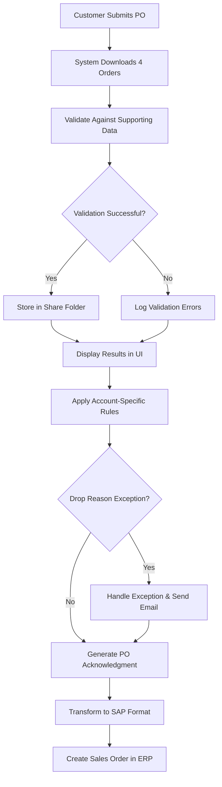

# Functional Design Document - Customer PO to Sales Order System

## Overview

The Customer PO to Sales Order system automates the complete business process of transforming customer purchase orders into ERP-ready sales orders. The system handles the entire workflow from order acquisition through validation, exception processing, acknowledgment generation, and final ERP integration.

The system operates on a scheduled processing model, handling exactly four customer orders per execution cycle, ensuring controlled throughput and reliable processing.

## Business Process Flow

### High-Level Process Flow

### Business Functions

1. **Order Acquisition**: Automated retrieval of customer purchase orders from external portal
2. **Data Validation**: Business rule validation against master data and customer-specific criteria
3. **Exception Management**: Handling of account-specific business logic and drop reasons
4. **Customer Communication**: Generation and delivery of order acknowledgments
5. **ERP Integration**: Transformation and creation of sales orders in the enterprise system

## Functional Components

### 1. Order Acquisition Function

**Business Purpose:**
- Retrieve customer purchase orders from the consumer portal on a scheduled basis
- Ensure exactly 4 orders are processed per cycle for controlled throughput
- Maintain connection reliability and handle portal availability issues

**Business Rules:**
- Process orders in chronological order of submission
- Skip duplicate orders already processed
- Handle portal maintenance windows gracefully

### 2. Order Validation Function

**Business Purpose:**
- Ensure order data integrity and completeness
- Validate against current product catalogs, pricing, and customer information
- Apply business rules for order acceptance criteria

**Validation Criteria:**
- Customer account status and credit limits
- Product availability and pricing accuracy
- Order quantity limits and minimum order values
- Delivery date feasibility

### 3. Exception Processing Function

**Business Purpose:**
- Handle customer-specific business requirements and exceptions
- Process drop reasons according to account-specific rules
- Manage escalation and notification workflows

**Exception Types:**
- Credit hold exceptions requiring approval
- Special pricing arrangements
- Custom delivery requirements
- Regulatory compliance requirements

### 4. Acknowledgment Generation Function

**Business Purpose:**
- Provide customers with confirmation of order receipt and processing status
- Include relevant order details and expected processing timeline
- Support different acknowledgment formats per customer preference

**Acknowledgment Content:**
- Order confirmation number
- Processing status and timeline
- Line item details and pricing
- Next steps and contact information

### 5. ERP Integration Function

**Business Purpose:**
- Transform validated purchase orders into ERP-compatible sales orders
- Ensure seamless integration with existing ERP workflows
- Maintain data consistency between systems

**Integration Requirements:**
- Map customer PO fields to SAP sales order structure
- Handle ERP-specific data formatting requirements
- Provide rollback capability for failed integrations

## Business Data Requirements

### Customer Purchase Order Data

**Required Information:**
- Customer identification and account details
- Order header information (PO number, date, terms)
- Line item details (products, quantities, pricing)
- Delivery instructions and requirements
- Special handling or processing notes

### Supporting Reference Data

**Product Master Data:**
- Product codes and descriptions
- Current pricing and discount structures
- Availability and lead time information
- Product categories and attributes

**Customer Master Data:**
- Account status and credit information
- Shipping and billing addresses
- Communication preferences
- Account-specific business rules and exceptions

**Business Rules Data:**
- Validation criteria and thresholds
- Drop reason definitions and handling procedures
- Approval workflows and escalation paths
- Notification templates and recipient lists

### Processing Status Tracking

**Order Lifecycle States:**
- Downloaded (from consumer portal)
- Validated (passed business rule validation)
- Exception (requires special handling)
- Acknowledged (confirmation sent to customer)
- Transformed (converted to ERP format)
- Created (sales order created in ERP)
- Failed (processing error occurred)

## Business Exception Handling

### Exception Categories

1. **Data Quality Issues**: Incomplete or invalid order information
2. **Business Rule Violations**: Orders that don't meet acceptance criteria
3. **Customer Account Issues**: Credit holds, inactive accounts, or special restrictions
4. **Product Availability**: Discontinued products or inventory constraints

### Exception Resolution Process

**Automated Resolution:**
- Apply customer-specific drop reason handling
- Execute predefined business rule exceptions
- Generate appropriate notifications and alerts

**Manual Review Process:**
- Queue orders requiring human intervention
- Provide detailed exception information to reviewers
- Track resolution actions and outcomes

**Escalation Procedures:**
- Define approval hierarchies for different exception types
- Set time-based escalation triggers
- Maintain audit trail of all exception handling activities

## User Interface Requirements

### Dashboard Functionality

**Order Processing Overview:**
- Real-time status of current processing cycle
- Summary of orders by processing stage
- Exception alerts and notifications

**Order Detail Views:**
- Individual order processing history
- Validation results and error details
- Exception handling status and actions taken

**Reporting Capabilities:**
- Processing cycle performance metrics
- Exception trend analysis
- Customer-specific processing statistics

### User Roles and Access

**Operations Manager:**
- Full system monitoring and configuration access
- Exception handling and approval authority
- System performance and reporting access

**Customer Service Representative:**
- Order status inquiry and basic exception handling
- Customer communication and acknowledgment management
- Limited reporting and dashboard access

## Integration Requirements

### Consumer Portal Integration

**Connection Requirements:**
- Secure API connectivity with authentication
- Scheduled polling or webhook-based order retrieval
- Error handling for portal unavailability

**Data Exchange Format:**
- Standardized order format from portal
- Acknowledgment delivery mechanism
- Status update communication protocol

### ERP System Integration

**SAP Integration Requirements:**
- Compatible data format for sales order creation
- Real-time or batch processing options
- Error handling and rollback capabilities

**Data Mapping Requirements:**
- Customer PO fields to SAP sales order fields
- Product code translation and validation
- Pricing and terms conversion