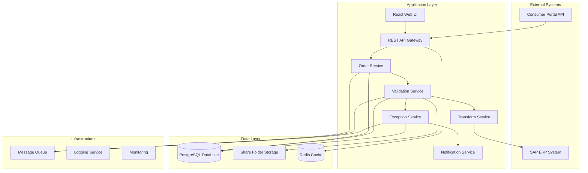

# Technical Design Document - Customer PO to Sales Order System

## Overview

This document outlines the technical architecture, implementation details, and system specifications for the Customer PO to Sales Order system. The system is built using a microservices architecture with event-driven processing, ensuring scalability, maintainability, and reliable integration with external systems.

## System Architecture

### High-Level Technical Architecture



### Technology Stack

**Backend Services:**
- **Runtime**: Node.js with TypeScript
- **Framework**: Express.js with Helmet security middleware
- **Database**: PostgreSQL with connection pooling
- **Caching**: Redis for session and data caching
- **Message Queue**: RabbitMQ for asynchronous processing
- **API Documentation**: OpenAPI/Swagger

**Frontend:**
- **Framework**: React with TypeScript
- **State Management**: Redux Toolkit
- **UI Components**: Material-UI
- **Build Tool**: Vite
- **Testing**: Jest + React Testing Library

**Infrastructure:**
- **Containerization**: Docker with multi-stage builds
- **Orchestration**: Docker Compose (development) / Kubernetes (production)
- **Monitoring**: Prometheus + Grafana
- **Logging**: Winston + ELK Stack
- **Security**: OAuth 2.0 + JWT tokens
## 
Service Architecture

### 1. Order Service

**Technical Responsibilities:**
- Consumer Portal API integration
- Order data persistence
- Processing orchestration
- Status tracking

**Implementation Details:**
```typescript
@Service()
export class OrderService {
  constructor(
    private consumerPortalClient: ConsumerPortalClient,
    private orderRepository: OrderRepository,
    private messageQueue: MessageQueue
  ) {}

  async downloadOrders(): Promise<RawPurchaseOrder[]> {
    const orders = await this.consumerPortalClient.fetchOrders(4);
    await this.orderRepository.saveRawOrders(orders);
    
    // Queue for validation
    for (const order of orders) {
      await this.messageQueue.publish('order.validation', order);
    }
    
    return orders;
  }
}
```

**API Endpoints:**
- `GET /api/orders` - Retrieve order list with filtering
- `GET /api/orders/{id}` - Get specific order details
- `POST /api/orders/download` - Trigger manual order download
- `GET /api/orders/{id}/status` - Get order processing status

### 2. Validation Service

**Technical Responsibilities:**
- Business rule validation engine
- Supporting data integration
- Validation result persistence
- Error classification and logging

**Implementation Details:**
```typescript
@Service()
export class ValidationService {
  constructor(
    private validationEngine: ValidationEngine,
    private supportingDataService: SupportingDataService,
    private orderRepository: OrderRepository
  ) {}

  @MessageHandler('order.validation')
  async validateOrder(order: RawPurchaseOrder): Promise<void> {
    const supportingData = await this.supportingDataService.getValidationData();
    const result = await this.validationEngine.validate(order, supportingData);
    
    await this.orderRepository.updateValidationResult(order.id, result);
    
    if (result.isValid) {
      await this.messageQueue.publish('order.exception-check', result);
    } else {
      await this.messageQueue.publish('order.validation-failed', result);
    }
  }
}
```

### 3. Exception Service

**Technical Responsibilities:**
- Account-specific rule processing
- Drop reason logic implementation
- Exception workflow management
- Notification triggering

### 4. Transform Service

**Technical Responsibilities:**
- SAP data format transformation
- Field mapping and validation
- ERP integration
- Rollback handling

## Data Architecture

### Database Schema

```sql
-- Core orders table
CREATE TABLE orders (
    id UUID PRIMARY KEY DEFAULT gen_random_uuid(),
    order_id VARCHAR(100) UNIQUE NOT NULL,
    customer_id VARCHAR(50) NOT NULL,
    status VARCHAR(50) NOT NULL,
    raw_data JSONB NOT NULL,
    validated_data JSONB,
    validation_errors JSONB,
    exception_status VARCHAR(50),
    sap_order_number VARCHAR(50),
    created_at TIMESTAMP WITH TIME ZONE DEFAULT NOW(),
    updated_at TIMESTAMP WITH TIME ZONE DEFAULT NOW(),
    processed_at TIMESTAMP WITH TIME ZONE
);

-- Processing audit log
CREATE TABLE processing_logs (
    id UUID PRIMARY KEY DEFAULT gen_random_uuid(),
    order_id UUID REFERENCES orders(id),
    service_name VARCHAR(100) NOT NULL,
    operation VARCHAR(100) NOT NULL,
    status VARCHAR(50) NOT NULL,
    details JSONB,
    execution_time_ms INTEGER,
    created_at TIMESTAMP WITH TIME ZONE DEFAULT NOW()
);

-- Customer rules configuration
CREATE TABLE customer_rules (
    id UUID PRIMARY KEY DEFAULT gen_random_uuid(),
    customer_id VARCHAR(50) NOT NULL,
    rule_type VARCHAR(100) NOT NULL,
    rule_config JSONB NOT NULL,
    is_active BOOLEAN DEFAULT true,
    created_at TIMESTAMP WITH TIME ZONE DEFAULT NOW(),
    updated_at TIMESTAMP WITH TIME ZONE DEFAULT NOW()
);

-- Indexes for performance
CREATE INDEX idx_orders_status ON orders(status);
CREATE INDEX idx_orders_customer_id ON orders(customer_id);
CREATE INDEX idx_orders_created_at ON orders(created_at);
CREATE INDEX idx_processing_logs_order_id ON processing_logs(order_id);
CREATE INDEX idx_customer_rules_customer_id ON customer_rules(customer_id);
```

## Integration Architecture

### Consumer Portal Integration

**API Client Implementation:**
```typescript
@Injectable()
export class ConsumerPortalClient {
  constructor(
    private httpClient: HttpClient,
    private config: ConsumerPortalConfig
  ) {}

  async fetchOrders(limit: number = 4): Promise<RawPurchaseOrder[]> {
    const response = await this.httpClient.get('/api/orders', {
      headers: {
        'Authorization': `Bearer ${this.config.apiKey}`,
        'Content-Type': 'application/json'
      },
      params: {
        limit: limit.toString(),
        status: 'pending'
      },
      timeout: 30000,
      retry: {
        retries: 3,
        retryDelay: 1000
      }
    });

    return response.data.orders.map(this.mapToRawPurchaseOrder);
  }
}
```

### ERP Integration

**SAP Integration Client:**
```typescript
@Injectable()
export class SAPERPClient {
  constructor(
    private sapClient: SAPClient,
    private config: SAPConfig
  ) {}

  async createSalesOrder(sapOrder: SAPSalesOrder): Promise<string> {
    const request = {
      SalesOrder: {
        SalesOrderType: 'OR',
        SalesOrganization: this.config.salesOrg,
        DistributionChannel: this.config.distributionChannel,
        Division: this.config.division,
        SoldToParty: sapOrder.customerNumber,
        PurchaseOrderByCustomer: sapOrder.customerPONumber,
        SalesOrderItem: sapOrder.lineItems.map(item => ({
          Material: item.materialNumber,
          RequestedQuantity: item.quantity,
          RequestedQuantityUnit: item.unit,
          NetPriceAmount: item.netPrice
        }))
      }
    };

    const response = await this.sapClient.post('/sap/opu/odata/sap/API_SALES_ORDER_SRV/A_SalesOrder', request);
    return response.data.d.SalesOrder;
  }
}
```

## Security Architecture

### Authentication & Authorization

```typescript
// JWT-based authentication middleware
@Injectable()
export class AuthenticationMiddleware {
  constructor(private jwtService: JWTService) {}

  async authenticate(req: Request, res: Response, next: NextFunction): Promise<void> {
    try {
      const token = this.extractToken(req);
      const payload = await this.jwtService.verify(token);
      req.user = payload;
      next();
    } catch (error) {
      res.status(401).json({ error: 'Unauthorized' });
    }
  }
}
```

## Performance & Scalability

### Caching Strategy

```typescript
// Redis-based caching service
@Injectable()
export class CacheService {
  constructor(private redis: Redis) {}

  async get<T>(key: string): Promise<T | null> {
    const cached = await this.redis.get(key);
    return cached ? JSON.parse(cached) : null;
  }

  async set<T>(key: string, value: T, ttlSeconds: number = 3600): Promise<void> {
    await this.redis.setex(key, ttlSeconds, JSON.stringify(value));
  }
}
```

### Message Queue Configuration

```typescript
// RabbitMQ configuration
export const messageQueueConfig = {
  exchanges: {
    'order-processing': {
      type: 'topic',
      durable: true
    }
  },
  queues: {
    'order.validation': {
      durable: true,
      arguments: {
        'x-message-ttl': 300000, // 5 minutes
        'x-dead-letter-exchange': 'order-processing-dlx'
      }
    },
    'order.exception-check': {
      durable: true,
      arguments: {
        'x-message-ttl': 300000
      }
    },
    'order.transform': {
      durable: true,
      arguments: {
        'x-message-ttl': 600000 // 10 minutes for ERP operations
      }
    }
  }
};
```

## Monitoring & Observability

### Health Checks

```typescript
// Health check endpoints
@Controller('/health')
export class HealthController {
  constructor(
    private db: Database,
    private redis: Redis,
    private messageQueue: MessageQueue
  ) {}

  @Get('/')
  async healthCheck(): Promise<HealthStatus> {
    const checks = await Promise.allSettled([
      this.checkDatabase(),
      this.checkRedis(),
      this.checkMessageQueue(),
      this.checkExternalAPIs()
    ]);

    const status = checks.every(check => check.status === 'fulfilled') ? 'healthy' : 'unhealthy';
    
    return {
      status,
      timestamp: new Date().toISOString(),
      checks: {
        database: checks[0].status === 'fulfilled' ? 'up' : 'down',
        redis: checks[1].status === 'fulfilled' ? 'up' : 'down',
        messageQueue: checks[2].status === 'fulfilled' ? 'up' : 'down',
        externalAPIs: checks[3].status === 'fulfilled' ? 'up' : 'down'
      }
    };
  }
}
```

## Deployment Configuration

### Docker Configuration

```dockerfile
# Multi-stage build for Node.js services
FROM node:18-alpine AS builder
WORKDIR /app
COPY package*.json ./
RUN npm ci --only=production

FROM node:18-alpine AS runtime
WORKDIR /app
COPY --from=builder /app/node_modules ./node_modules
COPY . .
EXPOSE 3000
CMD ["npm", "start"]
```

### Kubernetes Deployment

```yaml
apiVersion: apps/v1
kind: Deployment
metadata:
  name: order-service
spec:
  replicas: 3
  selector:
    matchLabels:
      app: order-service
  template:
    metadata:
      labels:
        app: order-service
    spec:
      containers:
      - name: order-service
        image: customer-po-system/order-service:latest
        ports:
        - containerPort: 3000
        env:
        - name: DATABASE_URL
          valueFrom:
            secretKeyRef:
              name: db-credentials
              key: url
        - name: REDIS_URL
          valueFrom:
            configMapKeyRef:
              name: app-config
              key: redis-url
```